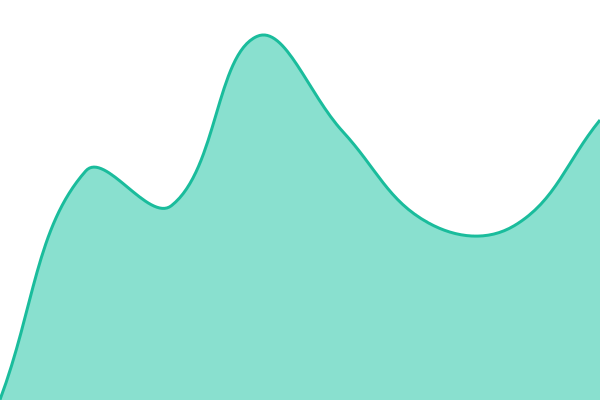

# [📈 Live Status](https://mrGhostage.github.io/guessr-place-status): <!--live status--> **🟩 All systems operational**

This repository contains the open-source uptime monitor and status page for [mrGhostage](https://mrGhostage.github.io/guessr-place-status), powered by [Upptime](https://github.com/upptime/upptime).

With [Upptime](https://upptime.js.org), you can get your own unlimited and free uptime monitor and status page, powered entirely by a GitHub repository. We use [Issues](https://github.com/mrGhostage/guessr-place-status/issues) as incident reports, [Actions](https://github.com/mrGhostage/guessr-place-status/actions) as uptime monitors, and [Pages](https://mrGhostage.github.io/guessr-place-status) for the status page.

<!--start: status pages-->
<!-- This summary is generated by Upptime (https://github.com/upptime/upptime) -->
<!-- Do not edit this manually, your changes will be overwritten -->
<!-- prettier-ignore -->
| URL | Status | History | Response Time | Uptime |
| --- | ------ | ------- | ------------- | ------ |
|  [Guessr Front](https://guessr.place/Healthz) | 🟩 Up | [guessr-front.yml](https://github.com/mrGhostage/guessr-place-status/commits/HEAD/history/guessr-front.yml) | 

 1328ms
     
 | 

<a href="https://mrGhostage.github.io/guessr-place-status/history/guessr-front">100.00%</a>
    

|  [Guessr API (prod)](https://api.guessr.place/Admin/healthz) | 🟩 Up | [guessr-api-prod.yml](https://github.com/mrGhostage/guessr-place-status/commits/HEAD/history/guessr-api-prod.yml) | 

 721ms
     
 | 

<a href="https://mrGhostage.github.io/guessr-place-status/history/guessr-api-prod">100.00%</a>
    

|  [Guessr Front (test)](https://test.guessr.place/Healthz) | 🟩 Up | [guessr-front-test.yml](https://github.com/mrGhostage/guessr-place-status/commits/HEAD/history/guessr-front-test.yml) | 

 1393ms
     
 | 

<a href="https://mrGhostage.github.io/guessr-place-status/history/guessr-front-test">100.00%</a>
    

|  [Guessr API (test)](https://test-api.guessr.place/Admin/healthz) | 🟩 Up | [guessr-api-test.yml](https://github.com/mrGhostage/guessr-place-status/commits/HEAD/history/guessr-api-test.yml) | 

 622ms
     
 | 

<a href="https://mrGhostage.github.io/guessr-place-status/history/guessr-api-test">100.00%</a>
    

<!--end: status pages-->

[**Visit our status website →**](https://mrGhostage.github.io/guessr-place-status)

## 📄 License

- Powered by: [Upptime](https://github.com/upptime/upptime)
- Code: [MIT](./LICENSE) © [Anand Chowdhary](https://anandchowdhary.com), supported by [Pabio](https://pabio.com)
- Data in the `./history` directory: [Open Database License](https://opendatacommons.org/licenses/odbl/1-0/)
